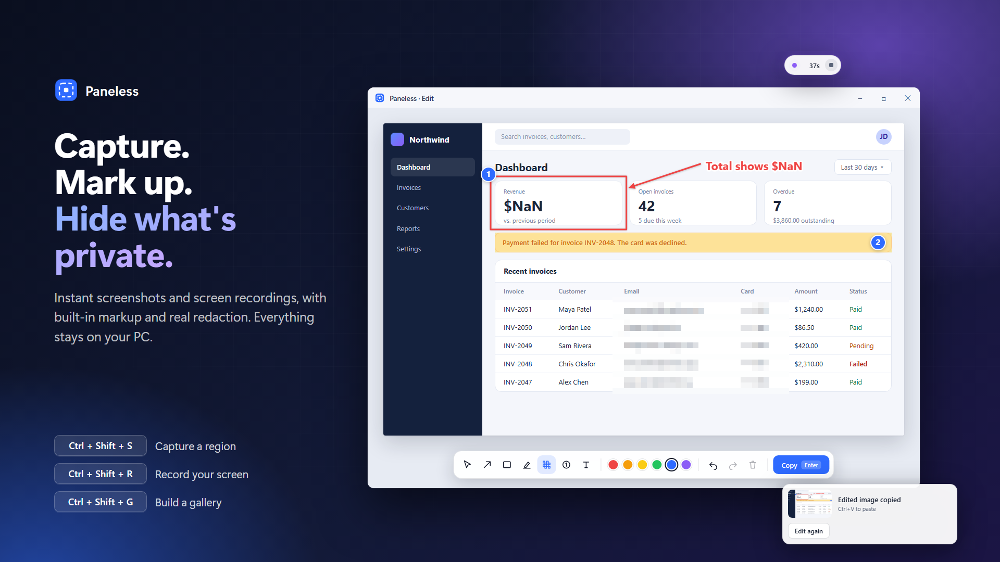

# Paneless

**Fast screenshots and screen recordings, without the pain.** A small Windows tray app for sharing bugs and features.

## What it does
- **Capture** a region of your screen straight to the clipboard (`Ctrl+Shift+S`)
- **Record** any part of your screen as a small video (`Ctrl+Shift+R`)
- **Mark up** with arrows, boxes, highlights, numbered steps and text, and **blur** anything private. Blur is a real redaction, so hidden content can't be recovered from the saved image.
- **Gallery mode** (`Ctrl+Shift+G`) gathers a set of screenshots and clips into one tidy web page you can share
- **Private by design:** everything stays on your computer. No account, no cloud, no tracking, no network connections.

More screenshots: [drag to capture](screenshots/02-drag-to-capture.png), [record your screen](screenshots/03-record-your-screen.png), [share as one page](screenshots/04-share-as-one-page.png).

## Requirements
Windows 10 (version 2004 or later) or Windows 11, 64-bit.

## Privacy
Paneless collects and sends nothing. Read the [privacy policy](PRIVACY.md).

## Support
Questions, bugs or ideas? [Open an issue](https://github.com/joshhebb/paneless/issues).